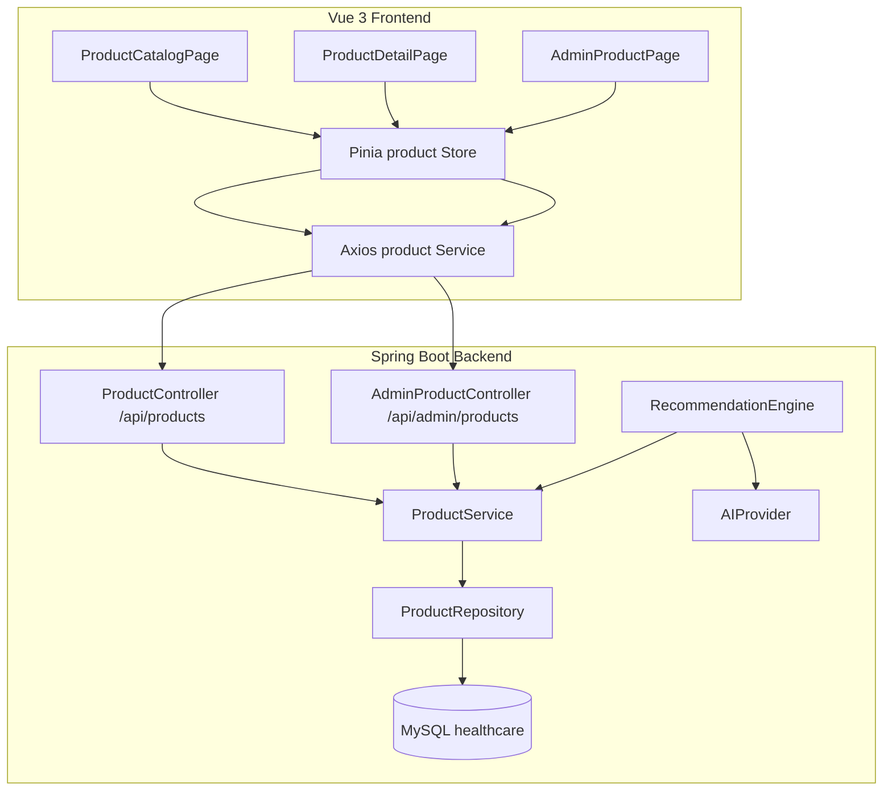
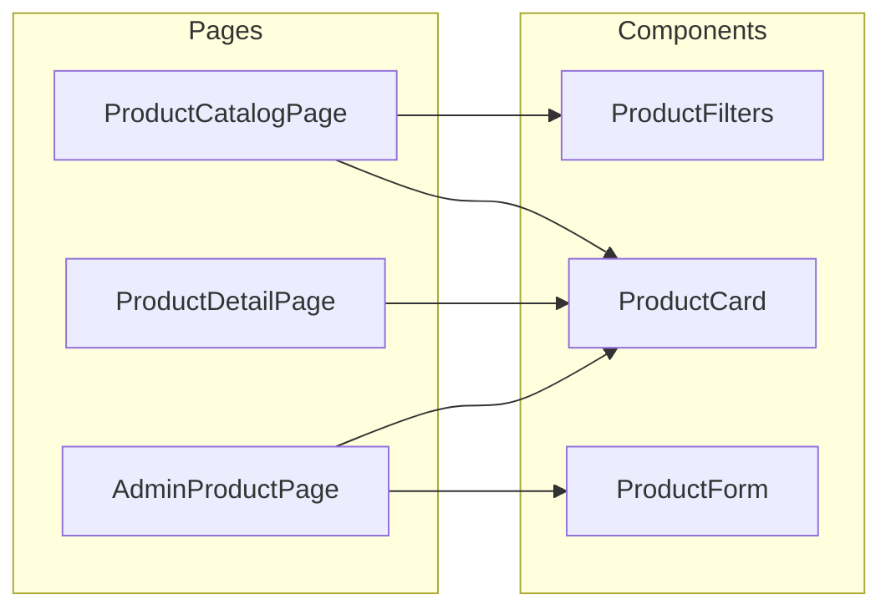

## 产品功能需求

### 核心功能范围

- **公共产品目录**：用户可浏览所有已上架的医疗保健产品
- **产品搜索与筛选**：支持按产品名称、类别、价格区间进行搜索和筛选
- **管理员 CRUD**：管理员可创建、编辑、删除产品
- **AI 推荐集成**：将现有的 AI 推荐引擎连接到真实数据库产品，而非虚构产品

### 产品数据模型（完整医疗保健产品架构）

- 基础字段：name、description、price、category、imageUrl
- 扩展字段：stockQuantity、manufacturer、dosage、ingredients
- 高级字段：prescriptionRequired、sideEffects
- 用户反馈：ratings（评分）、reviews（评论列表）

### 视觉与交互

- 产品目录页：网格布局展示产品卡片，侧边栏提供类别和价格筛选，顶部搜索栏
- 产品详情页：全宽展示产品图片、完整信息、成分列表、用户评价
- 管理员页面：表格视图列出所有产品，支持内联编辑和删除确认；弹窗表单用于新增/编辑

## 技术栈

| 层次 | 技术 | 版本 |
| --- | --- | --- |
| 后端框架 | Spring Boot | 4.1.0 |
| 语言 | Java | 17 |
| ORM | Spring Data JPA / Hibernate | 6.x |
| 数据库 | MySQL | 8.x |
| 构建工具 | Maven | 3.x |
| 工具库 | Lombok | 最新 |
| 前端框架 | Vue 3 | ^3.2.8 |
| 状态管理 | Pinia | ^2.3.1 |
| 路由 | Vue Router | ^4.6.4 |
| HTTP 客户端 | Axios | ^0.24.0 |
| 构建工具 | Vite | ^2.5.2 |


## 实现方案

### 整体策略

严格遵循项目现有的分层模式和编码规范。后端采用 Entity → DTO → Repository → Service → Controller 标准五层结构；前端采用 Page → Component → Store → Service 四层结构。所有新代码的文件命名、注解风格、包结构、API 路径命名均与现有 `consultation` 和 `ai` 模块保持一致。

### 关键设计决策

1. **产品类别枚举**：使用 JPA `@Enumerated(EnumType.STRING)` 定义产品类别（如 VITAMINS、PAIN_RELIEF、SKIN_CARE、DIGESTIVE_HEALTH 等），与现有 `Consultation.ConsultationStatus` 和 `Conversation.MessageRole` 枚举模式保持一致。

2. **AI 推荐与真实产品集成**：修改 `RecommendationEngine.buildRecommendationPrompt()`，注入 `ProductService` 获取所有可用产品列表并序列化到 AI prompt 中。AI 返回的 `RecommendedProduct.productName` 将通过名称匹配关联到 `Product.id`，使前端可以直接跳转到真实产品详情页。

3. **搜索与筛选**：在 `ProductRepository` 中使用 Spring Data JPA 的 `@Query` 支持名称模糊搜索（`LIKE %keyword%`）和类别精确匹配。前端 `ProductFilters` 组件采用基于 URL query 参数同步的方案，支持深度链接和浏览器前进/后退。

4. **评分与评论**：采用嵌入式方式——评论作为 `Product` 实体的 `@ElementCollection`，避免过早引入独立的评论微服务。当项目扩展到需要用户系统时，可平滑迁移为独立实体。

5. **API 路径命名**：公共 API 使用 `/api/products`，管理 API 使用 `/api/admin/products`，与现有 `/api/chat`、`/api/consultations` 路径风格一致。

### 实现注意事项

- **复用现有代码**：`services/product.js` 中 `apiClient` 的创建方式与 `services/chat.js` 完全一致；`stores/product.js` 的 Pinia Composition API 结构与 `stores/chat.js` 相同。
- **性能优化**：产品列表接口支持分页参数 `page` 和 `size`；ProductCard 使用 `v-for` 避免不必要的重渲染。
- **日志处理**：Controller 层使用 `@Slf4j` 记录关键操作日志，Service 层使用 `@Transactional` 确保数据一致性。
- **兼容性保证**：所有新 API 端点已被 `SecurityConfig.permitAll()` 覆盖；CORS 配置已允许 localhost:5173。

## 系统架构

### 后端模块交互图



### 前端组件关系图



## 目录结构

```
Backend/src/main/java/org/example/Healthcareplatform/
├── product/
│   ├── entity/
│   │   └── Product.java              # [NEW] JPA实体。定义完整医疗产品字段：id, name, description, price,
│   │                                    category(枚举), imageUrl, stockQuantity, manufacturer, dosage,
│   │                                    ingredients, prescriptionRequired, sideEffects, ratings, reviews。
│   │                                    reviews使用@ElementCollection存储评论列表。使用@CreationTimestamp和
│   │                                    @UpdateTimestamp自动管理时间戳。
│   ├── dto/
│   │   ├── ProductRequest.java       # [NEW] 创建/更新请求DTO。校验注解：name必填，price>0，
│   │   │                                category匹配枚举值。
│   │   └── ProductResponse.java      # [NEW] 响应DTO。包含所有Product字段的简化视图，
│   │                                    增加createdAt/updatedAt时间戳。
│   ├── repository/
│   │   └── ProductRepository.java    # [NEW] JPA Repository。扩展方法：
│   │                                    findByNameContainingIgnoreCase() 模糊搜索，
│   │                                    findByCategory() 类别精确匹配，
│   │                                    findByCategoryAndPriceBetween() 组合筛选，
│   │                                    均支持Pageable分页。
│   ├── service/
│   │   └── ProductService.java       # [NEW] 业务逻辑层。CRUD操作、搜索筛选、
│   │                                    批量获取产品ID到名称映射（供AI推荐使用）、
│   │                                    评分计算逻辑。
│   └── controller/
│       ├── ProductController.java    # [NEW] 公共API。GET /api/products（分页列表+搜索+筛选）、
│       │                                GET /api/products/{id}（详情）、
│       │                                GET /api/products/categories（类别列表）。
│       └── AdminProductController.java # [NEW] 管理API。POST/PUT/DELETE /api/admin/products，
│       │                                  POST /api/admin/products/{id}/image（图片上传占位）。
│
├── ai/recommendation/
│   └── RecommendationEngine.java     # [MODIFY] 注入ProductService，在buildRecommendationPrompt()中
│                                       将真实产品目录序列化后加入prompt，AI返回后通过名称匹配关联真实产品ID。
│                                       RecommendedProduct增加productId字段。

Frontend/src/
├── pages/
│   ├── ProductCatalogPage.vue        # [NEW] 产品目录主页面。顶部搜索栏+侧边筛选面板+网格产品卡片。
│   │                                    使用URL query参数同步搜索/筛选状态。
│   │                                    分页加载，滚动到底时自动加载更多。
│   ├── ProductDetailPage.vue         # [NEW] 产品详情页。左侧大图，右侧全量信息
│   │                                   （名称、价格、制造商、剂量、成分、副作用、是否处方药）。
│   │                                    底部评论区展示已有评论。
│   └── AdminProductPage.vue          # [NEW] 管理员产品管理页。表格展示所有产品，
│                                       支持搜索、分页、删除确认弹窗。
│                                        点击新增/编辑按钮弹出ProductForm弹窗。
├── components/product/
│   ├── ProductCard.vue               # [NEW] 产品卡片组件。显示图片、名称、类别标签、
│   │                                    价格、评分星级。点击跳转详情页。
│   ├── ProductFilters.vue            # [NEW] 筛选面板组件。类别多选chips + 价格区间滑块。
│   │                                    通过v-model与父组件双向绑定筛选条件。
│   └── ProductForm.vue               # [NEW] 产品编辑表单弹窗。完整表单包含所有字段，
│                                       支持新增/编辑模式切换。表单校验+提交loading状态。
├── stores/
│   └── product.js                    # [NEW] Pinia Store。状态：products列表、selectedProduct、
│                                        filters、pagination、isLoading、error。
│                                        Actions：fetchProducts、fetchProductById、
│                                        searchProducts、createProduct、updateProduct、
│                                        deleteProduct。
│                                        Getters：filteredProducts、categories。
├── services/
│   └── product.js                    # [NEW] Axios API服务。listProducts、getProduct、
│                                        searchProducts、createProduct、updateProduct、
│                                        deleteProduct、getCategories。
│                                        统一使用axios.create实例，与chat.js模式一致。
├── router/
│   └── index.js                      # [MODIFY] 新增3条路由：/products（ProductCatalogPage）、
│                                        /products/:id（ProductDetailPage）、
│                                        /admin/products（AdminProductPage）。
└── components/chat/
    └── ChatSidebar.vue               # [MODIFY] 新增"Browse Products"导航按钮，
                                        点击跳转到/products路由。图标使用shopping-bag SVG。
```

## 关键数据结构

### Product Entity 核心结构

```java
// product/entity/Product.java
@Entity
@Table(name = "products")
public class Product {
    @Id @GeneratedValue(strategy = GenerationType.IDENTITY)
    private Long id;
    
    @Column(nullable = false, length = 200)
    private String name;
    
    @Column(columnDefinition = "TEXT")
    private String description;
    
    @Column(nullable = false)
    private BigDecimal price;
    
    @Enumerated(EnumType.STRING)
    @Column(nullable = false, length = 30)
    private ProductCategory category;  // VITAMINS, PAIN_RELIEF, SKIN_CARE, DIGESTIVE_HEALTH, etc.
    
    @Column(name = "image_url", length = 500)
    private String imageUrl;
    
    @Column(name = "stock_quantity")
    private Integer stockQuantity;
    
    @Column(length = 200)
    private String manufacturer;
    
    @Column(length = 200)
    private String dosage;
    
    @Column(columnDefinition = "TEXT")
    private String ingredients;
    
    @Column(name = "prescription_required")
    private Boolean prescriptionRequired;
    
    @Column(columnDefinition = "TEXT")
    private String sideEffects;
    
    @Column(nullable = false)
    private Double ratings;  // average rating, default 0.0
    
    @ElementCollection
    @CollectionTable(name = "product_reviews", joinColumns = @JoinColumn(name = "product_id"))
    private List<Review> reviews;
    
    @CreationTimestamp private Instant createdAt;
    @UpdateTimestamp private Instant updatedAt;
}
```

### RecommendationResponse 增强

```java
// RecommendedProduct 新增字段
private Long productId;  // 关联的真实产品ID，AI推荐无匹配时为null
```

## 设计风格

采用**现代医疗科技风格**，延续项目已有的蓝色主色调设计系统。产品目录页采用清爽的网格卡片布局，融合柔和的渐变背景、微妙的阴影层次和流畅的过渡动画。

### 产品目录页

- 顶部为全宽搜索栏，带有药丸形输入框和搜索图标，聚焦时蓝色发光边框
- 左侧250px侧边筛选面板：类别chips（多选切换）、价格区间双滑块、清除筛选按钮
- 主区域为响应式网格（4列→3列→2列），每个产品卡片包含：白色圆角卡片容器、产品图片占位区（带渐变背景）、类别标签chip、产品名称、价格（粗体主色）、星级评分、悬浮时轻微上浮+阴影增强效果

### 产品详情页

- 两栏布局：左侧40%为产品大图区域（圆角卡片+浅灰背景），右侧60%为信息面板
- 信息面板自上而下：类别标签、产品名称（24px粗体）、价格（28px主色粗体）、制造商和剂量行、分隔线、"Description"折叠面板、"Ingredients"和"Side Effects"标签式切换、处方药红色Badge提示、评论区列表

### 管理员页面

- 顶部标题栏+新增产品按钮（主色调）
- 全宽白色表格：ID、名称、类别、价格、库存、操作列（编辑/删除图标按钮）
- 删除操作为红色文字+确认弹窗
- 新增/编辑使用居中模态弹窗（ProductForm），表单分两列排列，底部保存/取消按钮

### 动画效果

- 产品卡片悬浮：transform translateY(-4px) + box-shadow增强，过渡0.2s
- 模态弹窗：从透明+缩放(0.95)过渡到显示+缩放(1)
- 筛选chips切换：背景色平滑过渡

## 使用的代理扩展

### SubAgent

- **code-explorer**
- 用途：在实现过程中探索后端现有代码模式（Entity、Repository、Service、Controller 的具体写法），确保新代码与现有架构完全匹配
- 预期结果：获取关键参考文件的确切代码结构，新 Product 模块与现有 consultation/ai 模块风格完全一致

### Skill

- **find-skills**
- 用途：在需要时查找是否有适合产品图片处理、数据导入等辅助功能的技能
- 预期结果：发现可用的辅助技能扩展